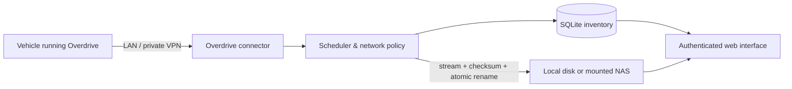

<div align="center">
  
  <h1>Overdrive Archive</h1>
  <p><strong>Self-hosted backup, synchronization, and media library for Overdrive vehicle data.</strong></p>
  <p>
    
    
    
    
  </p>
</div>

> [!IMPORTANT]
> Overdrive Archive is an unofficial community project. It is not affiliated
> with BYD or the maintainers of
> [Overdrive](https://github.com/yash-srivastava/Overdrive-release).

Overdrive Archive runs on your own server, NAS, Raspberry Pi, or home lab. It
connects to the HTTP API already provided by Overdrive, downloads the data you
select, checks expected recording sizes when Overdrive provides them, records
SHA-256 checksums, and presents the archive through an authenticated web
interface.

The project was designed to be reusable: there are no personal domains, fixed
vehicle models, hard-coded network rules, or private infrastructure
dependencies.

## Highlights

- Docker Compose deployment with hardened container defaults.
- Local disk or mounted NAS storage.
- Storage configured at both deployment and application levels.
- Manual, interval, and daily synchronization.
- Optional `Wi-Fi only` policy and SSID allowlist.
- Fixed recording queues with resumable `.part` downloads, byte-weighted
  progress, three-level priority, and an explicit Stop action.
- Configurable recording types and surveillance severity.
- Visual media library with authenticated thumbnails and HTTP Range streaming.
- In-player views for all cameras or one enlarged camera, without modifying the
  original recording.
- Optional import of the available Overdrive visual profile.
- Generic vehicle identity with persistent manual model, color, and drive-side
  values.
- Local password login enabled by default.
- Optional Telegram and WhatsApp one-time-code login.
- Persistent, revocable sessions and brute-force protection.
- SQLite inventory, run history, SHA-256 checksums, and deduplication.
- Optional local retention by category, protected latest items, and a global
  archive-size limit based on the mounted filesystem capacity.
- Selectable English and Brazilian Portuguese interface.
- No project analytics and no maintainer-operated cloud service.

## Supported data

| Category | Source | Archived result |
| --- | --- | --- |
| ACC and drive recordings | `/api/recordings` → `type=normal` | Media, metadata, and thumbnail |
| Instant replays | `/api/recordings` → `type=replay`, with the PR #150 legacy fallback | Media, metadata, and thumbnail |
| Surveillance recordings | `/api/recordings` → `type=sentry` | Media, metadata, and thumbnail |
| Proximity recordings | `/api/recordings` → `type=proximity` | Media, metadata, and thumbnail |
| OEM dashcam recordings | `/api/recordings` → `type=oemDashcam` | Media, metadata, and thumbnail |
| Trips | `/api/trips` | Paginated JSON snapshots |
| Trip telemetry and GPS trace | `/api/trips/{id}/telemetry` and `/gps` | Completed-trip JSON snapshots |
| Charging sessions | `/api/charging` | Paginated JSON snapshots |
| Automations | `/api/automations/list` | Read-only JSON snapshot |
| Key mappings | `/api/keymap/config` | Read-only JSON snapshot |
| Live telemetry | `/api/mqtt/telemetry` | Point-in-time JSON snapshot |
| RoadSense hazards | `/api/roadsense/hazards` | Experimental best-effort GeoJSON snapshot |
| Allowlisted configuration | `/api/settings/unified` | Opt-in sanitized JSON snapshot |

These collectors are implemented and covered by synthetic tests. Overdrive API
availability can vary by release and vehicle installation, so early adopters
should validate the selected categories on their own setup. Recordings have a
dedicated visual player; the other categories are currently preserved as
browsable/downloadable snapshots rather than full analytics screens. See
[the compatibility matrix](docs/compatibility.md) for limitations.

## How it works



The current implementation uses a pull model. The Docker application initiates
the connection to the vehicle, so no public inbound port is required on the
car. Tailscale is supported as a private network option, but it is not required.

## Quick start

Requirements:

- Git, or a downloaded source archive;
- Docker Engine with Docker Compose;
- OpenSSL or another secure password generator;
- a server that can reach the Overdrive web API through LAN or a private VPN;
- the Overdrive device access code or full device token.

An existing Overdrive bearer JWT can also be used for migrations from another
local integration. It is treated as an already-issued credential and is not
sent to `/auth/token`. Bearer JWTs expire and must be replaced when Overdrive
rejects them.

Clone the repository and prepare the local configuration:

```bash
git clone https://github.com/ThiagoCAltoe/overdrive-archive.git
cd overdrive-archive
cp .env.example .env
chmod 600 .env
openssl rand -hex 32
```

Open `.env` and paste the generated value after the existing
`ARCHIVE_ADMIN_PASSWORD=` entry.

The example password is intentionally empty. The application refuses to start
with local authentication enabled until the password contains at least 12
characters.

Start the application:

```bash
docker compose config --quiet
docker compose up -d --build
docker compose ps
curl --fail http://127.0.0.1:8088/healthz
```

On first start, a one-shot storage initializer verifies that the configured
unprivileged UID/GID can write to the database and archive directories. It
changes the ownership of those mount roots when needed. A new or empty
default-mode archive root is secured to `0700`; a non-empty archive or a
custom mode such as `0770` is preserved. Existing content is never changed
recursively.

Open:

```text
http://127.0.0.1:8088
```

The secure default binds the web interface only to the Docker host. From
another computer, either create an SSH tunnel:

```bash
ssh -L 8088:127.0.0.1:8088 user@your-server
```

or bind directly to the server's trusted LAN or private-VPN address:

```dotenv
ARCHIVE_BIND_ADDRESS=<server-lan-or-vpn-ip>
```

`0.0.0.0` listens on every host interface and should be used only when the host
firewall is intentionally configured for that exposure. Do not publish the
port directly to the public internet. Use HTTPS through an authenticated
reverse proxy or access it through a private VPN.

If startup fails, inspect the initializer and application logs:

```bash
docker compose logs storage-init archive
```

After signing in:

1. Open **Settings**.
2. Choose the interface language.
3. Enter the Overdrive URL, such as a LAN or Tailscale address.
4. Enter the 8-character access code, full device token, or an existing bearer
   JWT.
5. Select the schedule, network policy, data categories, and destination.
6. Optionally configure local retention and a storage limit.
7. Choose **Save & test connection**.
8. Start the first synchronization.

## Where files are stored

Storage has two independent configuration layers.

### 1. Docker or `.env`: choose the real host disk

Set `ARCHIVE_HOST_PATH` to a local directory or a NAS mount:

```dotenv
ARCHIVE_HOST_PATH=/mnt/nas/overdrive-archive
```

Docker mounts this host directory at `/archive` inside the container.

Examples:

- local disk: `/srv/overdrive-archive`;
- Synology NFS mount: `/mnt/synology/vehicle-backups`;
- UGREEN or other SMB mount: `/mnt/ugreen/overdrive`;
- default Compose path: `./archive`.

Mount NFS or SMB on the Docker host first. The application does not need
privileged mode and does not mount network filesystems itself.

The container uses UID/GID `10001` by default. If your NAS requires a different
numeric identity, set `ARCHIVE_UID` and `ARCHIVE_GID` in `.env`. The included
one-shot initializer validates access before the application starts. When the
configured identity changes or a legacy volume has not been prepared yet, it
repairs ownership throughout that volume once and records the completed
migration. It prints an actionable error if the share cannot be prepared.

`ARCHIVE_MAX_RECORDING_GB` limits one incoming recording; it is separate from
the optional total archive limit configured in the web application. With the
application limit disabled, the archive may use the whole available mounted
filesystem.

### 2. Web settings: choose the archive subdirectory

In **Settings → Destination**, configure a path below the mounted archive root,
for example:

```text
family-vehicles
```

The final host path becomes:

```text
/mnt/nas/overdrive-archive/family-vehicles/<vehicle>/...
```

This split is intentional:

- Docker controls which real disks or NAS shares the container may access.
- The web interface controls organization inside the approved volume.
- The web application cannot escape the mounted root with `..` or absolute host
  paths.

You can also set the initial web value through:

```dotenv
ARCHIVE_DEFAULT_SUBDIRECTORY=vehicles
```

An unsafe value fails startup with a configuration error instead of leaving the
installation running with a destination that cannot be used.

## Vehicle profile and model

The project is not tied to the Dolphin Mini or any single model.

When **Import the available Overdrive profile** is enabled, the application
reads:

- device ID, Overdrive version, locale, and distance unit from `/status`;
- model ID, color, and drive side from Overdrive's currently selected visual
  profile at `/api/models/selected`;
- the friendly model name from `/api/models/list`;
- the current recording and surveillance mosaic layouts from their read-only
  settings endpoints when available.

Device ID, version, locale, and distance unit are refreshed when the profile is
imported. Model, model name, color, and drive side are filled only when their
Archive fields are empty. Manual values remain editable and are preserved by
later connection tests and synchronization runs.

This is profile import, not hardware identification. The selected visual
profile may have been chosen manually inside Overdrive and does not prove the
physical vehicle model.

No VIN is required for setup and the project does not display a model-specific
private asset.

## Interface language

The web interface supports English and Português (Brasil). Choose the interface
language under **Settings → Interface**. The authenticated preference is stored
in the Archive installation and cached by the browser. This does not change the
language configured inside the vehicle.

## Camera views

Composed Overdrive recordings remain stored as their original MP4. The player
can show **All cameras**, **Front**, **Right**, **Rear**, or **Left** by
temporarily enlarging the corresponding region in the browser. It does not
create extra videos, re-encode the recording, or consume additional archive
space.

The selected camera is temporary: closing the player or opening another
recording resets the view to **All cameras**.

The archive does not transcode video. Browser playback therefore depends on
the codecs supported by that browser and operating system. A file that cannot
play inline can still be downloaded in its original form.

Both Overdrive `standard` 2×2 and `dashcam` mosaic layouts are supported.
Per-recording metadata takes priority, followed by the recording or surveillance
layout shown under **Settings → Vehicle connection**. Those values can be
imported from Overdrive or selected manually when automatic profile import is
disabled. Older recordings without layout metadata or a configured layout fall
back to `standard`. OEM dashcam files are treated as a single-camera source and
do not display the mosaic selector.

Overdrive PR
[#153](https://github.com/yash-srivastava/Overdrive-release/pull/153)
localizes the canonical `seagull` model as “BYD Dolphin Mini” for Brazilian
Portuguese inside Overdrive. It does not change the model ID or lock this
archive to that vehicle. See [compatibility details](docs/compatibility.md).

## Authentication

The installer chooses which methods are available. Multiple methods can be
enabled at the same time, and the login page only displays configured methods.

### Username and password — default

```dotenv
ARCHIVE_AUTH_LOCAL_ENABLED=true
ARCHIVE_ADMIN_USERNAME=admin
ARCHIVE_ADMIN_PASSWORD=
```

Set the blank password to a generated value before starting the container.
Passwords are stored as salted `scrypt` hashes. The application includes:

- per-account and per-network rate limiting for the local administrator;
- progressive delays after repeated failures;
- a global temporary local-account lock after repeated failures, including
  attempts from different IP addresses;
- persistent revocable sessions;
- absolute and inactivity expiration;
- `HttpOnly` and `SameSite=Strict` cookies;
- same-origin checks for state-changing requests.

### Telegram one-time code — optional

1. Create a bot with BotFather.
2. Send a message to the bot from the chat that may receive login codes.
3. Find that chat ID.
4. Configure:

```dotenv
ARCHIVE_TELEGRAM_BOT_TOKEN=
ARCHIVE_TELEGRAM_CHAT_ID=
```

Telegram appears on the login page only when both values are present.

### WhatsApp one-time code — optional

Overdrive Archive uses a generic outbound webhook so it can work with an
existing self-hosted WhatsApp gateway.

```dotenv
ARCHIVE_WHATSAPP_WEBHOOK_URL=https://whatsapp-gateway.example/send
ARCHIVE_WHATSAPP_WEBHOOK_TOKEN=
ARCHIVE_WHATSAPP_RECIPIENT=
```

The webhook receives:

```json
{
  "recipient": "<configured recipient>",
  "message": "Your Overdrive Archive sign-in code is 123456...",
  "purpose": "overdrive-archive-login"
}
```

If `ARCHIVE_WHATSAPP_WEBHOOK_TOKEN` is set, it is sent as:

```http
Authorization: Bearer <token>
```

Telegram and WhatsApp codes:

- contain six digits;
- expire after ten minutes;
- are single-use;
- are invalidated when a newer code is successfully delivered;
- limit delivery per requesting identity, with a separate higher provider
  ceiling;
- isolate verification-failure lockouts by provider and requesting identity;
- never appear in application logs.

Sensitive values also support Docker secret files by setting a corresponding
`_FILE` variable when that file is mounted inside the container. The included
[`compose.secrets.yaml`](compose.secrets.yaml) override demonstrates a
file-backed administrator password:

```bash
mkdir -p secrets
openssl rand -base64 32 > secrets/archive_admin_password
chmod 700 secrets
chmod 600 secrets/archive_admin_password
docker compose -f compose.yaml -f compose.secrets.yaml up -d --build
```

The `secrets/` directory is excluded from Git and the Docker build context.
Telegram and WhatsApp provider tokens support the same `_FILE` convention when
mounted through a site-specific Compose override.

To run without local password login, first configure and successfully test an
OTP provider. Then set:

```dotenv
ARCHIVE_AUTH_LOCAL_ENABLED=false
ARCHIVE_ADMIN_PASSWORD=
```

At least one valid authentication method is required. Keep local login enabled
until Telegram or WhatsApp delivery has been tested, otherwise a provider
configuration error can lock the operator out.

See [authentication details](docs/authentication.md).

## Synchronization policy

Available schedule modes:

- manual;
- every X minutes, hours, or days;
- daily at a configured time and timezone.

The `Wi-Fi only` setting is a normal switch, not a hard-coded rule:

- enabled: `/status.network.type` must be `wifi`;
- disabled: cellular, Ethernet, or other reachable networks are allowed;
- optional SSID allowlist: when `Wi-Fi only` is enabled, synchronization runs
  only on approved Wi-Fi names.

The connector checks the network before a run and periodically during large
downloads. The same policy applies to scheduled and manually started runs. In a
server-side pull model this is best-effort; a future vehicle-side push agent can
enforce it continuously.

Collection, recording-selection, and network settings are snapshotted when a
run starts. Changing **Wi-Fi only** while a run is active applies to the next
run; use **Stop synchronization** on the active row in **Synchronization runs**
to stop the current run safely. Local retention is separate: the current saved
retention rules are applied after the run finishes.

## Recording selection

Recording types:

- ACC / drive;
- instant replay;
- surveillance;
- proximity;
- OEM dashcam.

Overdrive-reported severity filters apply to Surveillance and Proximity clips:

- `NOTICE`: background, passing, unknown/animal, or static non-person activity;
- `ALERT`: nearby people or approaching vehicle/bicycle activity;
- `CRITICAL`: the closest or strongest threat reported by Overdrive, commonly a
  very-close person.

The archive does not calculate or change these labels. With no severity selected,
the severity filter is disabled. A recording without `peakSeverity` is retained
rather than silently discarded.

Replay compatibility follows both upstream generations:

- Overdrive PR
  [#150](https://github.com/yash-srivastava/Overdrive-release/pull/150)
  creates `replay_YYYYMMDD_HHMMSS[_N].mp4` files but exposes them as
  `type=normal`.
- Overdrive PR
  [#152](https://github.com/yash-srivastava/Overdrive-release/pull/152)
  migrates those rows to the dedicated API type `replay` and adds the in-car
  Replays views.

Overdrive Archive prefers the dedicated `replay` type and recognizes the
`replay_` filename fallback returned by PR #150-era builds. The subtype is
preserved in metadata and in the archive path. This compatibility is covered by
local tests; end-to-end vehicle validation remains recommended while the
project is in early preview.

Overdrive Archive only downloads and indexes recordings already exposed by the
vehicle API. It does not create instant replays, configure key code `306`, or
change the in-car Replays tab, indicator, or ordering. Those behaviors belong
to Overdrive PRs #150 and #152.

## File integrity and layout

Recordings are:

1. placed in a fixed queue that does not grow until the next synchronization;
2. prioritized as validated `.part` downloads, older backlog, then newly
   discovered files;
3. streamed to a deterministic `.part` file and resumed with validated HTTP
   Range metadata when supported by the vehicle;
4. limited by a configurable maximum size;
5. checked against the expected Overdrive size when available;
6. hashed with SHA-256;
7. flushed to disk;
8. bound to a durable completion proof containing its source identity, size,
   and SHA-256;
9. atomically renamed;
10. added to the SQLite inventory with its optional sidecars;
11. stripped of temporary resume and completion metadata only after the
    inventory commit succeeds.

If Overdrive rotates a clip after all bytes arrived but before inventory or
sidecar creation finishes, the next run validates and archives that completed
local copy. Ambiguous or unverifiable partial data is preserved instead of
being silently deleted or presented as a valid video.

Queue progress is weighted by expected bytes, not file count. A 1 GiB partial
inside a 10 GiB known-size queue therefore reports 10%. If any queued item has
no declared size, the interface shows indeterminate progress instead of an
invented percentage. A stopped run keeps a validated `.part` for the next run
and never starts a second synchronization behind the first one.

Recording identity uses the vehicle identity, filename, and source timestamp.
A source-owned directory containing the stable vehicle identity and exact
millisecond timestamp keeps the physical path unique even when Overdrive
corrects a timestamp or two configured vehicles share the same display name.
Inventory paths created by an older release remain readable and are separated
lazily if a later synchronization detects that two identities share one path.
A missing local file or an expected-size mismatch is downloaded again. If a
vehicle silently replaces a recording while keeping the same filename,
timestamp, and byte size and exposes no checksum, that change cannot be
distinguished without downloading the entire file again; this limitation is
reported rather than hidden.

Example:

```text
archive/
└── vehicles/
    └── my-vehicle/
        ├── recordings/
        │   ├── drive/2026/07/16/
        │   ├── replay/2026/07/16/
        │   │   └── vehicle-a1b2c3d4e5f60718293a4b5c-1784208612000/
        │   │       ├── replay_20260716_143012.mp4
        │   │       ├── replay_20260716_143012.metadata.json
        │   │       └── replay_20260716_143012.jpg
        │   ├── surveillance/2026/07/16/
        │   ├── proximity/2026/07/16/
        │   └── oem_dashcam/2026/07/16/
        ├── trips/
        ├── charging/
        ├── automations/
        ├── key_mappings/
        ├── telemetry/
        ├── roadsense/
        └── configuration/
```

The **Archive library** opens with the **Recordings** category selected so video
is not mixed with configuration, telemetry, or other JSON snapshots. **All
categories** remains available when an operator explicitly selects it. Results
are loaded in ordered pages; **Load more** keeps older recordings accessible
without making the first library request grow with the complete archive.

## Local retention and storage limit

Retention is disabled by default. In **Settings → Local retention**, each
archive category can independently delete local copies older than a number of
minutes, hours, or days. Age uses the original source timestamp when available
and falls back to the local archive time. **Keep the latest X items** protects
that category's newest items even when they are older than the configured age.
Saving settings applies enabled retention rules immediately to local files.

The optional storage limit uses the mounted archive filesystem capacity as the
largest value offered by the interface. When the archive is over its configured
limit, unprotected local items are removed from oldest to newest. If protected
or unmanaged files alone exceed the limit, the application reports that the
limit could not be reached and does not break the protection promise.

Retention deletes the primary local file and known local sidecars such as the
thumbnail, metadata, event timeline, and resumable partial. It then keeps a
zero-byte **Deleted locally** database placeholder while a complete recording
listing still reports the original on the vehicle. The placeholder prevents an
automatic redownload, shows the remote file size separately, and offers
**Download again**.

Local deletion is journaled before any primary file is moved. After an
interrupted process or container restart, startup either restores the inventory
file or finishes the already-committed cleanup, so an application crash cannot
strand an untracked hidden copy. Physical power-loss durability still follows
the guarantees of the mounted local, NFS, or SMB filesystem.

Restoring a recording bypasses the current type, severity, and age filters but
still follows the configured network policy. A restored file is manually
protected from retention so the same rule cannot immediately remove it again.
The archived card offers **Use retention rules** to remove that protection; the
current rules may then delete the local copy immediately.

A placeholder disappears only after a complete, internally consistent vehicle
listing confirms that the original is gone. Timeouts, incomplete pages,
cancelled runs, and other partial listings never purge it. Retention never calls
a vehicle deletion endpoint and never removes or changes a recording stored in
the car.

## Privacy and security

Vehicle data can reveal homes, routes, people, conversations, and vehicle
identifiers. Before exposing the web application outside a trusted network:

- put it behind HTTPS;
- set `ARCHIVE_SECURE_COOKIES=true`;
- prefer a private VPN or authenticated reverse proxy;
- encrypt the server or NAS filesystem;
- protect backups of `/data` and `/archive`;
- never commit `.env`, SQLite files, recordings, exports, thumbnails, or logs.

The saved Overdrive access code or token is stored in the private SQLite state
under `/data` so scheduled synchronization can authenticate without operator
input. Treat the entire `/data` directory as a secret, restrict its backups,
and use disk or dataset encryption on the Docker host.

Full Overdrive configuration backup is intentionally excluded. The optional
configuration collector retains only explicitly approved scalar settings inside
approved sections. Unknown fields, nested objects outside that allowlist, URLs,
and long strings are discarded. The resulting snapshot can still reveal
vehicle behavior and preferences and must be treated as sensitive.

Read [SECURITY.md](SECURITY.md) and [PRIVACY.md](PRIVACY.md) before deployment.

## Troubleshooting

For common startup, networking, synchronization, storage, and playback
problems, see [the troubleshooting guide](docs/troubleshooting.md).

## Configuration reference

| Variable | Default | Purpose |
| --- | --- | --- |
| `ARCHIVE_BIND_ADDRESS` | `127.0.0.1` | Host interface that publishes the web UI |
| `ARCHIVE_HTTP_PORT` | `8088` | Port exposed on the Docker host |
| `ARCHIVE_DATA_PATH` | `./data` | SQLite, settings, session, and authentication state |
| `ARCHIVE_HOST_PATH` | `./archive` | Real host or NAS directory for archived files |
| `ARCHIVE_UID` | `10001` | Numeric user ID used to write database and archive files |
| `ARCHIVE_GID` | `10001` | Numeric group ID used to write database and archive files |
| `ARCHIVE_DEFAULT_SUBDIRECTORY` | `vehicles` | Initial destination path in the web UI |
| `ARCHIVE_ADMIN_USERNAME` | `admin` | Local administrator username |
| `ARCHIVE_ADMIN_PASSWORD` | — | Local administrator password |
| `ARCHIVE_AUTH_LOCAL_ENABLED` | `true` | Enable local username/password login |
| `ARCHIVE_TELEGRAM_BOT_TOKEN` | — | Telegram bot token |
| `ARCHIVE_TELEGRAM_CHAT_ID` | — | Authorized Telegram destination |
| `ARCHIVE_WHATSAPP_WEBHOOK_URL` | — | WhatsApp gateway endpoint |
| `ARCHIVE_WHATSAPP_WEBHOOK_TOKEN` | — | Optional bearer token for the gateway |
| `ARCHIVE_WHATSAPP_RECIPIENT` | — | Recipient understood by the gateway |
| `ARCHIVE_SECURE_COOKIES` | `false` | Require HTTPS for the session cookie |
| `ARCHIVE_MAX_RECORDING_GB` | `20` | Safety limit for a single recording |
| `ARCHIVE_MEMORY_LIMIT` | `768m` | Compose memory limit for the application |
| `ARCHIVE_PIDS_LIMIT` | `256` | Compose process/thread limit |
| `TZ` | `UTC` | Container timezone and initial schedule timezone |

See [.env.example](.env.example) for a complete template.

## Upgrades and backups

Back up both persistent locations before every upgrade:

- the host path configured by `ARCHIVE_DATA_PATH`, which contains SQLite and
  authentication state;
- the host or NAS path configured by `ARCHIVE_HOST_PATH`, which contains the
  archived media and snapshots.

For a consistent filesystem copy, stop the `archive` service while taking the
backup. Then update and rebuild:

```bash
docker compose stop archive
# Copy ARCHIVE_DATA_PATH and ARCHIVE_HOST_PATH to protected backup storage.
git pull --ff-only
docker compose up -d --build
```

Database schema migrations run automatically during application startup. Do
not delete the data/archive mounts or use volume-removal commands as an upgrade
step.

## Development

The application code uses Python's standard library, SQLite, and browser-native
JavaScript, with no third-party Python or Node packages. The container includes
`ffmpeg` only to generate local JPEG thumbnails when Overdrive does not provide
one. There is no Redis, Celery, PostgreSQL, or Node build pipeline.

Run locally:

```bash
make run
```

The development target binds to localhost and keeps its database and files
under `./.dev/`, separate from the default Compose paths. Set
`DEV_ADMIN_PASSWORD`, `DEV_DATA_DIR`, or `DEV_ARCHIVE_ROOT` in the environment
before invoking `make` when an override is needed.

Run checks:

```bash
make check
node --check app/static/app.js
```

Build the container:

```bash
make docker-build
```

Read [CONTRIBUTING.md](CONTRIBUTING.md) before opening a pull request. Only
synthetic data is allowed in tests and documentation.

## Roadmap

- [x] Docker Compose deployment.
- [x] Local / mounted-NAS destination.
- [x] Configurable Wi-Fi policy.
- [x] Recording, trip, charging, automation, key mapping, telemetry, and
  strict-allowlist configuration collectors.
- [x] Optional Overdrive visual-profile import with persistent manual values.
- [x] Local, Telegram, and generic WhatsApp authentication options.
- [ ] SFTP destination.
- [ ] WebDAV destination.
- [ ] S3-compatible destination.
- [x] Per-category retention, keep-latest protection, and filesystem-aware
  storage limits.
- [ ] Notification hooks for failed runs.
- [ ] Multiple vehicles.
- [ ] Vehicle-side push agent with strict Wi-Fi enforcement and resumable
  uploads.

## License

Overdrive Archive is available under the [MIT License](LICENSE).
